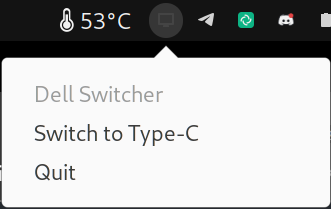

# Ugly switcher DELL source




Able to switch to Type-C from DP/HDMI via <kbd>Alt</kbd>+<kbd>s</kbd> or tray menu

Required installed `ddcutil` and `notify-send`  
`ddcutil` should be granted work without root access.

```bash
sudo modprobe i2c-dev
sudo groupadd ddc
sudo usermod -aG ddc $USER
```

```bash
git clone https://github.com/Toxblh/dell-switcher-linux
cd dell-switcher-linux
cargo run
# or 
cargo build --release
./target/release/dell-switcher-linux
```
